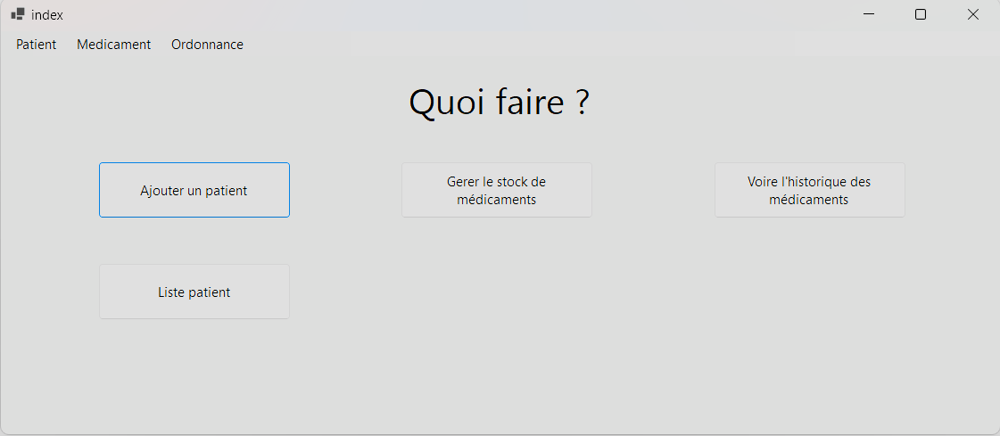

# Compte rendu du PPE3 - David GAILLETON
## Contexte
### Description du laboratoire GSB
#### Le secteur d'activité
L’industrie pharmaceutique est un secteur très lucratif dans lequel le mouvement de fusion acquisition est très fort. Les regroupements de laboratoires ces dernières années ont donné naissance à des entités gigantesques au sein desquelles le travail est longtemps resté organisé selon les anciennes structures.

Des déboires divers récents autour de médicaments ou molécules ayant entraîné des complications médicales ont fait s'élever des voix contre une partie de l'activité des laboratoires : la visite médicale, réputée être le lieu d' arrangements entre l'industrie et les praticiens, et tout du moins un terrain d'influence opaque.

#### L'entreprise
Le laboratoire Galaxy Swiss Bourdin (GSB) est issu de la fusion entre le géant américain Galaxy (spécialisé dans le secteur des maladies virales dont le SIDA et les hépatites) et le conglomérat européen Swiss Bourdin (travaillant sur des médicaments plus conventionnels), lui même déjà union de trois petits laboratoires .

En 2009, les deux géants pharmaceutiques ont uni leurs forces pour créer un leader de ce secteur industriel. L'entité Galaxy Swiss Bourdin Europe a établi son siège administratif à Paris.

Le siège social de la multinationale est situé à Philadelphie, Pennsylvanie, aux Etats-Unis.

La France a été choisie comme témoin pour l'amélioration du suivi de l'activité de visite

### L'application mis en place

L'application présentée dans ce compte rendu permet de répondre à la problématique de gestion des patients par les médecins du laboratoire.

La suivie des patients étant parfois compliqués, notamment sur les antécédents, les allergies et l'historique d'ordonnances, les médecins pourront avoir un aperçu sur les informations du patient facilement.
## Mise en place
### Prérequis
#### .NET Core
En premier temp il faut installer **.NET 7.0** en allant sur le site de Microsoft : 
	[https://dotnet.microsoft.com/en-us/download/dotnet/7.0](https://dotnet.microsoft.com/en-us/download/dotnet/7.0)  
ou directement en cliquant [ici](https://dotnet.microsoft.com/en-us/download/dotnet/thank-you/sdk-7.0.405-windows-x64-installer)
#### Visual C++
En suite, installez **VC++** depuis le lien suivant :
	[https://learn.microsoft.com/fr-fr/cpp/windows/latest-supported-vc-redist?view=msvc-170](https://learn.microsoft.com/fr-fr/cpp/windows/latest-supported-vc-redist?view=msvc-170)
Il faut installer les versions :
- Visual Studio 2015, 2017, 2019 et 2022 **x64**
- Visual Studio 2013 **x64**
- Visual Studio 2013 **x86**
- Visual Studio 2012 **x64**
- Visual Studio 2012 **x86**
- Visual Studio 2010 **x64**
- Visual Studio 2010 **x86**
#### Visual Studio
Visual Studio est l'IDE utilisé pour visualiser le code et les vue du projet.
Il est installable depuis cette page : 
[https://visualstudio.microsoft.com/fr/](https://visualstudio.microsoft.com/fr/)

Il faut bien installer la version **Community 2022**


Une fois installé, **Visual Studio Installer** va se lancer et vous proposer de choisir une "charges de travail", sélectionnez **Développement .NET Desktop** et cliquez sur installer ou modifier en bas à droite :


#### WAMP
WAMP est une application permettant de simplement mettre en place une base de données.
Pour l'installation, dirigé vous directement sur le [site officiel de WAMP](https://www.wampserver.com/en/download-wampserver-64bits/), et dans la section Downloads, sélectionner **WAMPSERVER 64 BITS (X64)** et télécharger le sans vous inscrire en cliquant sur **you can download it directly** :


Si une erreur se produit lors de l'installation, c'est surement que l'installation de **Visual C++** n'a pas été faite correctement.

### Installation de l'application
#### Téléchargement du Projet depuis GitHub
Pour le téléchargement, dirigez-vous sur la page [GitHub du projet](https://github.com/DavidGailleton/medic-manager-CScharp-PPE3), déroulez l'icone *Code* et cliquez sur *Download ZIP* :


Une fois le téléchargement terminé, dirigez-vous vers le répertoire **Téléchargements** puis extrayez le projet :


Une fois extrait, vous devriez retrouver les fichiers du projet de cette manière :


#### Mise en place de Wamp
Si l'installation de wamp c'est bien déroulé, vous devriez pouvoirs le lancer depuis la barre de recherche de Windows : 


Une fois lancé, il devrait être accessible depuis le lien suivant :
http://localhost/phpmyadmin

Sur la page de connexion, entrez **root** comme nom d'utilisateur sans mot de passe et connectez-vous :


Une fois connectée, cliquez sur **modifier le mot de passe** :


Puis dans **Saisir** et **Saisir à nouveau**, entrez le mot de passe `fuy8TLB8FaAQf@_Twu7*Tg3Z@jJ_opUyomn.cwP7`, puis **Exécuter** :


Une fois le mot de passe modifié, créer une **nouvelle base de données** (1.), en la nommant ppe3 (2.), puis en cliquant sur **créer**(3.) :


Une fois créé, il faut importer les tables et données nécessaires au fonctionnement de l'application.
Pour ce faire, il faut sélectionner la BDD **ppe3**(1.), cliquer sur l'onglet **Importer**(2.), puis sélectionner **Parcourir...**(3.) :


Ensuite sélectionnez le fichier `ppe3.sql` présent dans la racine du projet précédemment téléchargé, et cliquez sur ouvrir :


Enfin, descendez en bas de la page et cliquez sur **Importer**:


La base de données est dorénavant prête à être utilisée par l'application.
## Structure de la base de donnée
### MCD


Pour avoir plus d'informations sur le MCD, vous pouvez installer l'application **JMerise** et ouvrir le fichier PPE3.MCD disponible à la racine du projet.
## L'application

### Lancer l'application

Pour démarrer l'application, il suffit d'accéder au dossier deploy :


Puis de cliquer sur le fichier `PPE3.exe` :


### Sécurité
Afin de ne pas enregistrer les mot de passe des utilisateurs et administrateurs en clair dans la base de données, il est impératif de le crypter au préalable.
Pour hasher les mot de passe l'application utilise l'algorithme de **BCrypt**. Cet algorithme permet de crypter un mot de passe sans qu'il soit possible de le décrypter. 

L'encryptions se fait via une fonction proposée par BCrypt demandant 2 paramètres, le mot de passe à hasher et un indice permettant de plus ou moins "encrypter" le mot de passe :
```c#
BCrypt.Net.BCrypt.EnhancedHashPassword(password, 13)
```

Pour vérifier si le mot de passe est correct, un autre fonction est utilisé. Cette fonction prend 2 paramètres, le mot de passe à vérifier et le mot de passe hashé, le mot de passe est bien celui qui a été utilisé pour faire le hash, la fonction retournera `true` :
```c#
BCrypt.Net.BCrypt.EnhancedVerify(password, hashPassword)
```
### Page de connexion


La page de connexion permet d'accéder à l'application destiné aux médecins, accessible en sélectionnant **Utilisateur**.  
Les identifiants mis a disposition pour tester l'application côté médecine sont :
	Username : jean.dupont
	Password : motdepasse123

Ceux cotés Administrateurs sont :
	Username : serv_admin
	Password : motdepasse123

Pour présenter les fonctions et méthode utilisé lors de la connexion, je vais seulement montrer celles utilisé pour les médecins car celles utilisées pour les administrateurs sont équivalentes.

La connexion fonctionne de cette manière :
```c#
// connexion sur la base utilisateur
if (comboBox1.Text == "Utilisateur")
{
    string login = usernameTextBox.Text;
    string password = passwordTextBox.Text;
    MedecinDataAccess dataAccess = new MedecinDataAccess();
    // Requete vérifiant la si l'identifiant et le mot de passe de l'utilisateur est correcte 
    Medecin result = dataAccess.ConnectMedecinFromDB(login, password);
    // Si la requete ne retourne rien, alors l'utilisateur est informé que l'identifiant ou le mot de est incorrecte
    if (result.Login == "")
    {
        MessageBox.Show("Identifiant ou mot de passe incorrect");
    }
    // Si l'utilisateur se connecte pour la première fois, il devra modifier son mot de passe 
    else if (dataAccess.VerifyFirstConnection(login) == "Success")
    {
        NewMedecinPassword newPassword = new(login, this);
        newPassword.Show();
        this.Hide();

    }
    // Si tout est correcte, l'utilisateur sera connecté
    else if (dataAccess.VerifyFirstConnection(login) == "Error" && result.Login == login)
    {
        Index index = new(result, this);
        index.Show();
        this.Hide();
    }
    // Prévient de toutes erreurs inconnus
    else
    {
        MessageBox.Show("Une erreur est survenue");
    }
}
```
Pour vérifier la validité des connexions, j'utilise uns fonction vérifiant si l'utilisateur existe et si le mot de passe est correct :
```c#
// Vérifie la validité des identifiant fournie sur la page de connexion
public Medecin ConnectMedecinFromDB(string login, string pass)
{
    using (MySqlConnection conn = new MySqlConnection(connectionString))
    {
        conn.Open();
        // Requete visant à vérifier si l'utilisateur existe et récupère son mot de passe Hashé
        string query1 = "SELECT password_med FROM medecin WHERE login_med = @login";
        // Requete visant à importer les information nécessaire à la création d'un objet Medecin
        string query2 = "SELECT nom_med, prenom_med, naissance_med, login_med FROM medecin WHERE login_med = @login";

        using (MySqlCommand command1 = new MySqlCommand(query1, conn))
        {
            command1.Parameters.AddWithValue("@login", login);
            string result = Convert.ToString(command1.ExecuteScalar());
            // Vérifie si le retour n'est pas null ou vide puis vérifie la validité du mot de passe en utilisant Bcrypt afin
            if (result != null && result != "" && BCrypt.Net.BCrypt.EnhancedVerify(pass, result) == true)
            {
                using (MySqlCommand command2 = new MySqlCommand(query2, conn))
                {
                    command2.Parameters.AddWithValue("@login", login);
                    MySqlDataAdapter adapter2 = new MySqlDataAdapter(command2);
                    DataTable dt = new DataTable();
                    dt.Columns.Add("nom_med", typeof(string));
                    dt.Columns.Add("prenom_med", typeof(string));
                    dt.Columns.Add("naissance_med", typeof(DateTime));
                    dt.Columns.Add("login_med", typeof(string));
                    adapter2.Fill(dt);
                    conn.Close();
                    // Créer un tableau d'objet Medecin qui contiendra forcement qu'un seul élément car la données login_med est forcement Unique
                    List<Medecin> medecins = new();
                    if (dt.Rows.Count > 0)
                    {
                        foreach (DataRow row in dt.Rows)
                        {
                            string nom = row["nom_med"].ToString();
                            string prenom = row["prenom_med"].ToString();
                            DateTime dateTime = (DateTime)row["naissance_med"];
                            string log = row["login_med"].ToString();

                            Medecin med = new(nom, prenom, dateTime, log);

                            medecins.Add(med);
                        }
                        // Retourne le premiere élément du tableau d'objet medecins
                        return medecins[0];
                    }
                    // Retourne un objet medecin contenant des valeurs vide pour signalé que l'utilisateur n'existe pas ou que le mot de passe n'est pas valide
                    else
                    {
                        Medecin med = new("", "", DateTime.UtcNow, "");
                        return med;
                    }
                }
            }
            else
            {
                Medecin med = new("", "", DateTime.UtcNow, "");
                return med;
            }
        }
    }
}
```

Pour vérifier si c'est la première connexion de l'utilisateur j'utilise une donnée booléenne présente dans les tables `medecin` et `admin` nommé respectivement `first_connection_med` et `first_connection_adm`.
La fonction utilisée est celle-ci :
```c#
// vérifie si c'est la première connexion de l'utilisateur
public string VerifyFirstConnection(string login)
{
    using (MySqlConnection conn = new(connectionString))
    {
        conn.Open();
        // selectionne la valeur booleen contenu dans la column first_connection_med de la table medecin selon l'idientifiant fournie
        string query = "SELECT first_connection_med FROM medecin WHERE login_med = @login";
        using (MySqlCommand command = new MySqlCommand(query, conn))
        {
            command.Parameters.AddWithValue("@login", login);
            int result = Convert.ToInt32(command.ExecuteScalar());
            conn.Close();
            // Si le résultat est 0, la fonction confirme que ce n'est pas la première connexion de l'utilisateur
            if (result == 0)
            {
                return "Error";
            }
            // Sinon, la fonction coonfirme que c'est sa première connexion
            else
            {
                return "Success";
            }
        }
    }
}
```

#### Changement de mot de passe
Dans le cas où l'utilisateur se connecte pour la première fois, il lui sera demandé de modifier son mot de passe afin qu'aucun administrateur ne puisse connaitre son mot de passe après sa première connexion.

La page s'agence comme ceci :


Le code fonctionne comme ceci :
```c#
 private void button1_Click(object sender, EventArgs e)
 {
     MedecinDataAccess dataAccess = new MedecinDataAccess();
     // Vérifie si le mot de passe original est correcte
     string result = dataAccess.VerifyPassword(this.login, original_maskedTextBox.Text.ToString());

     if (result == "Success")
     {
         // Verifie si le nouveau mot de passe est la confirmation du nouveau mot de passe sont les mêmes
         if (new_maskedTextBox.Text == confirmeNew_maskedTextBox.Text)
         {
             // Vérifie si la longueur du mot de passe est supérieur à 8 caractères
             if (new_maskedTextBox.TextLength > 8)
             {
                 // Modifie le mot de passe de l'utilisateur
                 string result2 = dataAccess.UpdateMedecinPasswordInDB(login, new_maskedTextBox.Text);
                 if (result2 == "Success")
                 {
                     MessageBox.Show("Nouveau mot de passe établie");
                     this.Close();
                 }
                 else
                 {
                     MessageBox.Show("Une erreur inconnu c'est produite");
                 }
             }
             else
             {
                 MessageBox.Show("Le mot de passe doit contenir minimum 8 caractères");
             }
         }
         else
         {
             MessageBox.Show("Le mot de passe original ou la confirmation du nouveau mot de passe n'est pas valide");
         }
     }
     else
     {
         MessageBox.Show("Mot de passe original incorrect");
     }
 }
```
Elle appelle la fonction `VerifyPassword` pour vérifier si le mot de passe original est correct : 
```C#
// Verifie si le mot de passe est correcte
public string VerifyPassword(string login, string password)
{
    using (MySqlConnection conn = new MySqlConnection(connectionString))
    {
        conn.Open();
        // Selectionne le mot de passe Hashé contenue dans la Table medecin
        string query1 = "SELECT password_med FROM medecin WHERE login_med = @login";

        using (MySqlCommand command1 = new MySqlCommand(query1, conn))
        {
            command1.Parameters.AddWithValue("@login", login);
            // Execute la requete
            string result = Convert.ToString(command1.ExecuteScalar());
            // Vérifie si le mot de passe n'est pas null, puis s'il est correcte
            if (result != null && BCrypt.Net.BCrypt.EnhancedVerify(password, result) == true)
            {
                return "Success";
            }
            else
            {
                
                return "Error";
            }
        }
    }
}
```
Si toutes les conditions sont correctes, alors le mot de passe va être mis à jour via la fonction `UpdateMedecinPasswordInDB` :
```c#
// met à jour le mot de passe
public string UpdateMedecinPasswordInDB(string login, string password)
{
    using (MySqlConnection conn = new(connectionString))
    {
        conn.Open();
        // Requete mettant à jour le mot de passe du medecin et change l'etat de la colonne first_connection_med afin de confirmer que l'utilisateur à bien modifier son mot de passe 
        string query = "UPDATE medecin SET password_med = @password, first_connection_med = 0 WHERE login_med = @login";
        using (MySqlCommand command = new MySqlCommand(query, conn))
        {
            command.Parameters.AddWithValue("@login", login);
            command.Parameters.AddWithValue("@password", BCrypt.Net.BCrypt.EnhancedHashPassword(password, 13));
            int result = command.ExecuteNonQuery();
            conn.Close();
            // Verifie si le mot de passe a bien été mis à jour
            if (result < 0)
            {
                return "Error";
            }
            else
            {
                return "Success";
            }
        }
    }
}
```

Une fois mis à jour, l'utilisateur peut se connecter sans problème
### Base Utilisateur
Une fois connecter vous tomberez sur une interface permettant d'accéder aux différents menus de l'application : 



#### Ajouter un patient 
La page d'ajout d'un nouveau patient se présente comme ceci :


Une fois les différentes cases remplies, vous pouvez appuyer sur **créer** ce qui exécutera cette méthode :
```c#
 // créer un nouveau patient
 private void create_button_Click(object sender, EventArgs e)
 {
     // Vérifie si toutes les cases sont remplie
     if (surname_textbox.Text != "" && name_textbox.Text != "" && sexe == "h" | sexe == "f")
     {
         PatientDataAccess dataAccess = new PatientDataAccess();
         // Créer un objet de la classe Patient
         Patient patient = new Patient(surname_textbox.Text, name_textbox.Text, birthday_DateTimePicker.Value.Date, sexe, (long)long.Parse(noSecu_TextBox.Text));
         // Execute la fonction AddPatientInDB pour créer un nouveau patient
         string result = dataAccess.AddPatientInDB(patient);
         // Si la création c'est bien passé, ouvrir la page de profile du patient créé
         if (result == "Success")
         {
             PatientProfile pp = new(patient, medecin);
             pp.Show();
             this.Close();
         }
         else
         {
             MessageBox.Show("Une erreur c'est produite");
         }
     }
 }
```

Cette méthode appelle la fonction `AddPatientInDB` :
```c#
// Ajoute un nouveau Patient dans la table patient
public string AddPatientInDB(Patient patient)
{
    using (MySqlConnection conn = new MySqlConnection(connectionString))
    {
        conn.Open();
        // Requete SQL permettant d'ajouter un nouveau patient au seins de la table patient
        string query = "INSERT INTO patient (nom_pat, prenom_pat, naissance_pat, sexe_pat, no_secu_pat) VALUES (@nom, @prenom, @naissance, @sexe, @no_secu)";
        using (MySqlCommand command = new MySqlCommand(query, conn))
        {
            command.Parameters.AddWithValue("@nom", patient.Nom);
            command.Parameters.AddWithValue("@prenom", patient.Prenom);
            command.Parameters.AddWithValue("@naissance", patient.Naissance);
            command.Parameters.AddWithValue("@sexe", patient.Sexe);
            command.Parameters.AddWithValue("@no_secu", patient.NoSecu);
            
            // Execution de la requete SQL
            int result = command.ExecuteNonQuery();
            conn.Close();
            // Retourne un erreur si la requete n'affecte aucune ligne, sinon retourne "Success"
            if (result < 0)
            {
                return "Error";
            }
            else
            {
                return "Success";
            }
        }
    }
}
```

Une fois le patient créé, la page de profile du patient va s'ouvrir.

#### Liste des patients existant
Dans le cas ou le patient a déjà été créé, il est possible de simplement le rechercher en cliquant sur **Liste patient** sur la page d'accueil.
La page listant les patients se présente de cette manière :


##### Search()
Cette vue propose une boîte de recherche qui utilise la fonction `Search()` utilisé dans d'autres vues :
```c#
// Recherche une donnée présente dans la premiere colonne d'un tableau en fonction d'une boite de texte
public void Search(System.Windows.Forms.TextBox textBox, DataGridView dataGridView)
{
    BindingSource bs = new();
    bs.DataSource = dataGridView.DataSource;
    // Cherche au seins de la première colonne du tableau, une chaine de caractères présente n'importe où dans une autre chaine de caractères
    bs.Filter = dataGridView.Columns[0].HeaderText.ToString() + " LIKE '%" + textBox.Text + "%'";
    // Modifie le tableau pour afficher uniquement les lignes recherchées
    dataGridView.DataSource = bs;
}
```

##### Importation du tableau
Pour importer le tableau on utilise la fonction `SelectPatientsFromDB()`:
```c#
// Retourne tous les patients contenue dans la Table Patient
public DataTable SelectPatientsFromDB()
{
    using (MySqlConnection conn = new MySqlConnection(connectionString))
    {
        conn.Open();
        // Requete SQL important les différents éléments nécessaire à la création d'un objet de classe patient
        string query = "SELECT nom_pat AS nom, prenom_pat AS prenom, naissance_pat AS date_de_naissance, sexe_pat AS sexe, no_secu_pat AS numero_de_securite_social FROM patient";
        using (MySqlCommand command = new MySqlCommand(query, conn))
        {
            MySqlDataAdapter adapter = new MySqlDataAdapter(command);
            DataTable dt = new DataTable();
            // Remplie une table de données contenant toutes les données importé de la table patient
            adapter.Fill(dt);
            conn.Close();
            return dt;
        }
    }
}
```
##### Sélection d'un patient
Pour sélectionner un patient il suffit simplement de cliquer sur une case du tableau, puis la ligne sera contenue dans un objet de la classe patient comme ceci :
```c#
// Selection d'un patient en cliquant sur un ligne
private void dataGridView1_CellContentClick(object sender, DataGridViewCellEventArgs e)
{
    if (e.RowIndex >= 0 & e.RowIndex < dataGridView1.RowCount - 1)
    {
        // Selectionne les informations contenu dans la ligne selectionné
        DataGridViewRow selectedRow = this.dataGridView1.Rows[e.RowIndex];
        // encapsule dans des variables les différents informations contenu dans la ligne séléctionné
        string nom = selectedRow.Cells["Nom"].Value.ToString();
        string prenom = selectedRow.Cells["prenom"].Value.ToString();
        DateTime naissance = (DateTime)selectedRow.Cells["date_de_naissance"].Value;
        string sexe = selectedRow.Cells["sexe"].Value.ToString();
        long no_secu = (long)selectedRow.Cells["numero_de_securite_social"].Value;
        // Créer un objet de la classe Patient
        Patient patient = new Patient(nom, prenom, naissance, sexe, no_secu);
        this.selectedPatient = patient;

    }
}
```

##### Bouton Sélectionner
Le bouton sélectionné permet d'accéder au profil du patient :
```c#
    private void select_button_Click(object sender, EventArgs e)
    {
        // Si un patient est selectionné, ouvrir son profile
        if (selectedPatient != null)
        {
            PatientProfile patientProfile = new PatientProfile(selectedPatient, medecin);
            patientProfile.Show();
            this.Close();
        }
        else
        {
            MessageBox.Show("Aucun patient selectionné");
        }
    }
}
```

#### Profile du patient


Le profil du patient permet de voir les différentes allergies et antécédents du patient. Ces informations sont importées depuis la table `etre` pour les allergies, la table `etre` contenant les clés primaires de la table allergie et de la table `patient`. Pour les antécédents le fonctionnement est différent, c'est directement la table `Antecedant` qui contient la clé primaire du patient car les antécédents sont uniques selon le patient contrairement aux allergies qui peuvent être attribuées à plusieurs patients.

##### Importation des antécédents 
L'importations des antécédents ce fait de cette manière :
```c#
// Importation des antécédents d'un patient
public DataTable SelectPatientAntecedantsFromDb(Patient patient)
{
    using (MySqlConnection conn = new MySqlConnection(connectionString))
    {
        conn.Open();
        // Requete SQL important les données antécédants selon la clé primaire du patient
        string query = "SELECT libelle_ant AS libelle FROM antecedent WHERE id_pat = @id_pat";
        using (MySqlCommand command = new MySqlCommand(query, conn))
        {
            PatientDataAccess dataAccess = new PatientDataAccess();
            command.Parameters.AddWithValue("@id_pat", dataAccess.GetPatientIdFromDB(patient));
            MySqlDataAdapter adapter = new MySqlDataAdapter(command);
            DataTable dt = new DataTable();
            // Créer une table de données contenants toutes les lignes importées
            adapter.Fill(dt);
            conn.Close();
            return dt;
        }
    }
}
```

##### Importation des Allergie
```c#
// Importe les allergie du patient
public DataTable SelectPatientAllergiesFromDb(Patient patient)
{
    using (MySqlConnection conn = new MySqlConnection(connectionString))
    {
        conn.Open();
        // Requete SQL important les allergies depuis la table etre en fonction de la clé primaire de l'utilisateur en joignant la table etre et allergie
        string query = "SELECT libelle_all AS libelle FROM etre INNER JOIN allergie ON allergie.id_all = etre.id_all WHERE id_pat = @id_pat";
        using (MySqlCommand command = new MySqlCommand(query, conn))
        {
            PatientDataAccess dataAccess = new PatientDataAccess();
            command.Parameters.AddWithValue("@id_pat", dataAccess.GetPatientIdFromDB(patient));
            MySqlDataAdapter adapter = new MySqlDataAdapter(command);
            DataTable dt = new DataTable();
            adapter.Fill(dt);
            conn.Close();
            return dt;
        }
    }
}
```

#### Ajout d'un antécédant
Pour ajouter un antécédent, il faut cliquer sur **Ajouter** en dessous du tableau des antécédents.
Ainsi une nouvelle page va s'ouvrir :


Une fois sur cette page, vous pouvez nommer le nom de l'antécédent et ajouter des médicaments incompatibles comme ci-dessus.
Lors de l'ajout, cette fonction sera exécutés :
```c#
// ajout d'un antécedent dans la base de donnée
public string AddAntecedantInDB(string libelle, Patient patient)
{
    using (MySqlConnection conn = new MySqlConnection(connectionString))
    {
        conn.Open();
        // Requete ajoutant un antécedent dans la table antecedent
        string query = "INSERT INTO antecedent (libelle_ant, id_pat) VALUES (@libelle, @id_pat)";
        using (MySqlCommand command = new MySqlCommand(query, conn))
        {
            PatientDataAccess dt = new();
            // Récupération de l'ID du patient pour l'ajouter à la table antecedant
            int id_pat = (int)dt.GetPatientIdFromDB(patient);
            command.Parameters.AddWithValue("@libelle", libelle);
            command.Parameters.AddWithValue("@id_pat", id_pat);
            // Execution de la requete
            int result = command.ExecuteNonQuery();
            conn.Close();
            if (result < 0)
            {
                return "Error";
            }
            else
            {
                return "Success";
            }
        }
    }
}
```

Vous pouvez ajouter autant d'antécédents que voulu avant de retourner sur le profil en cliquant sur **Retourner en arrière**.

#### Ajout d'une allergie
La page d'ajout d'allergie se présente de cette manière :


Elle permet de lier une allergie au patient sur la table `etre` de la base de données, mais aussi d'ajouter une allergie non disponible sur la table `allergie`.
##### Ajouter une nouvelle allergie sur la table `allergie`
Pour ajouter une nouvelle allergie sur la table `allergie` il suffit de remplir la boîte de texte à droite du bouton **Ajouter une nouvelle allergie** puis de cliquer sur cette dernière. Elle sera ensuite aujouté à la table allergie via la requête SQL suivante :
```sql
INSERT INTO allergie (libelle_all) VALUES (@libelle)
```

Pour affecter une allergie au patient il faut ensuite la sélectionner sur la table de données et cliquer sur **Ajouter l allergie**. Ce bouton appellera la fonction `AddAllergieToPatientInDB()` :
```c#
public string AddAllergieToPatientInDB(Allergie allergie, Patient patient)
{
    using (MySqlConnection conn = new MySqlConnection(connectionString))
    {
        conn.Open();
        // Requete SQL ajoutant l'id primaire de l'allergie et du patient dans la table etre
        string query = "INSERT INTO etre (id_all, id_pat) VALUES (@id_all, @id_pat)";
        using (MySqlCommand command = new MySqlCommand(query, conn))
        {
	        // Ajoute de l'identifiant Allergie à la requete
            command.Parameters.AddWithValue("@id_all", GetAllergieIdFromDB(allergie));
            PatientDataAccess dt = new();
            // Ajout de l'identifiant du patient à la requete
            command.Parameters.AddWithValue("@id_pat", dt.GetPatientIdFromDB(patient));
            // Execution de la requete
            int result = command.ExecuteNonQuery();
            conn.Close();
            if (result < 0)
            {
                return "Error";
            }
            else
            {
                return "Success";
            }
        }
    }
}
```

#### Création d'un ordonnance
La création d'une ordonnance ce fait depuis le profil du patient. En cliquant sur **Nouvelle ordonnance**, une nouvelle page s'ouvre :


Elle permet de sélectionner un médicament selon les médicaments contenu dans la base `medicament`, de remplir la posologie, la durée du traitement et les instructions. Une fois les infos nécessaires remplie, il suffit de cliquer sur le bouton créé et un objet de la classe `ordonnance` sera créé pour faire appel à la fonction `AddOrdonnanceInDB` :
```c#
// Importation d'une ordonnance dans la base de données et ouverture de celle ci
private void button1_Click(object sender, EventArgs e)
{
    // Création d'un objet de la classe ordonnance
    Ordonnance ordonnance = new(this.posologie_richTextBox.Text.ToString(), (int)numericUpDown1.Value, this.Instruction_richTextBox.Text.ToString(), DateTime.Now, this.patient, this.selectedMedic, this.medecin);
    OrdonnanceDataAccess oda = new();
    // appel de la fonction AddORdonnanceInDB permettant d'ajouter une nouvelle ordonnance dans la base de données
    string result = oda.AddOrdonnanceInDB(ordonnance);
    // Si la requete SQL c'est dérouler correctement, alors l'ordonnance s'affichera
    if (result == "Success")
    {
        MessageBox.Show("Ordonnance cree");
        OrdonnanceView ov = new(ordonnance);
        ov.Show();
        this.Close();
    }
}
```

##### `AddOrdonnanceInDB()`
La fonction `AddOrdonnanceInDB()` fonctionne de cette manière :
```c#
// Ajoute une nouvelle ordonnance dans la table ordonnance de la BDD
public string AddOrdonnanceInDB(Ordonnance ordonnance)
{
    using (MySqlConnection conn = new MySqlConnection(connectionString))
    {
        conn.Open();
        // Requete SQL ajoutant un ligne dans la table ordonnance de la bdd
        string query = "INSERT INTO ordonnance (posologie_ord, date_creation_ord, duree_ord, instruction_ord, id_med, id_pat, id_medic) VALUES (@posologie, @date_creation, @duree, @instruction, @id_med, @id_pat, @id_medic)";
        using (MySqlCommand command = new MySqlCommand(query, conn))
        {
            PatientDataAccess patientDataAccess = new PatientDataAccess();
            MedecinDataAccess medecinDataAccess = new MedecinDataAccess();
            MedicamentDataAccess medicamentDataAccess = new MedicamentDataAccess();
            command.Parameters.AddWithValue("@posologie", ordonnance.Posologie);
            command.Parameters.AddWithValue("date_creation", ordonnance.Date_creation);
            command.Parameters.AddWithValue("@duree", ordonnance.Duree);
            command.Parameters.AddWithValue("@instruction", ordonnance.Instruction);
            command.Parameters.AddWithValue("@id_med", medecinDataAccess.GetMedecinIdFromDB(ordonnance.Medecin));
            command.Parameters.AddWithValue("@id_pat", patientDataAccess.GetPatientIdFromDB(ordonnance.Patient));
            command.Parameters.AddWithValue("@id_medic", medicamentDataAccess.GetMedicamentIdFromDB(ordonnance.Medicament));
            int result = command.ExecuteNonQuery();
            conn.Close();
            if (result < 0)
            {
                return "Error";
            }
            else
            {
                return "Success";
            }
        }
    }
}
```

Une fois créé, l'ordonnance va s'afficher.

#### Historique des ordonnances
Une autre manière d'afficher une ordonnance est de se diriger vers l'historique des ordonnances depuis la page d'accueil.
La page se présente de la même manière que la [liste des patients](#liste-des-patients-existant) et fonctionne de la même manière :


#### Affichage d'un ordonnance


L'ordonnance se présente de manière simple en affichant les informations a la manière d'une réel ordonnance.
La fonction intéressante de cette page est de pouvoir enregistrer l'ordonnance au format pdf. Cette fonction est rendue possible grâce à l'extension **IText7** en permet entre autres de créer et d'agencer des fichiers PDF de manière simple.
La méthode permettant d'enregistrer l'ordonnance au format pdf fonctionne de cette manière :
```c#
// Permet d'enregistrer l'ordonnance au format PDF
private void print_button_Click(object sender, EventArgs e)
{
    SaveFileDialog saveFileDialog = new SaveFileDialog();
    // Donne un nom par défaut au fichier qui sera enregistrer
    saveFileDialog.FileName = "Ordonnance_" + ordonnance.Patient.Nom + "_" + ordonnance.Patient.Prenom + "_" + ordonnance.Date_creation.Year.ToString() + "_" + ordonnance.Date_creation.Month.ToString() + "_" + ordonnance.Date_creation.Day.ToString();
    // Permet d'afficher seulement les fichiers pdf lors de l'enregistrement
    saveFileDialog.Filter = "PDF Files|*.pdf";
    // Le fichier sera enristrer au format pdf par défaut
    saveFileDialog.DefaultExt = "pdf";
    // l'emplacement par défaut sera le dossier téléchargement de l'utilisateur
    saveFileDialog.InitialDirectory = @"%Download%";
    if (saveFileDialog.ShowDialog() == DialogResult.OK)
    {
        // enregistre dans une variable l'emplacement et le nom du fichier à enregistrer
        string fileName = Path.GetFullPath(saveFileDialog.FileName);

        using (PdfWriter writer = new PdfWriter(fileName))
        {
            using (PdfDocument pdf = new PdfDocument(writer))
            {
                Document document = new Document(pdf);

                // Création d'objet Paragraph destiné à etre ajouté dans l'ordonnance
                Paragraph medecinNom = new Paragraph("Docteur " + ordonnance.Medecin.Nom);
                Paragraph patientNom = new Paragraph(genre + " " + ordonnance.Patient.Nom + " " + ordonnance.Patient.Prenom);
                Paragraph date = new Paragraph("Le " + ordonnance.Date_creation.Day + " " + ordonnance.Date_creation.Month + " " + ordonnance.Date_creation.Year);
                Paragraph medic = new Paragraph(ordonnance.Medicament.Libelle + ", " + ordonnance.Posologie + " - " + ordonnance.Instruction + " " + ordonnance.Duree + " jours");

                // ajout des différents paragraphe dans l'ordonnance avec leurs emplacements
                document.Add(medecinNom.SetTextAlignment(TextAlignment.LEFT));
                document.Add(date.SetTextAlignment(TextAlignment.RIGHT));
                document.Add(patientNom.SetTextAlignment(TextAlignment.LEFT));
                document.Add(medic.SetTextAlignment(TextAlignment.LEFT));

                // Enregistrement du PDF
                document.Close();
            }
        }
    }
}
```
Une boite de dialogue s'ouvrira donc pour choisir l'emplacement et le nom du fichier à enregistrer :


Une fois enregistrez-vous pouvez enregistrer, vous pouvez l'imprimer avec le logiciel de votre choix comme Adobe Acrobat par exemple.

#### Gestion de stock de médicaments
Ce logiciel permet également de faire une gestion de stock de médicaments, bien que cet aspect puisse être amélioré.
Cette page est accessible depuis la page d'accueil via le bouton **Gerer le stock de médicaments**.

La page se présente de cette manière :


Cette page utilise 2 requête sql :
Importation des médicaments autorisés :
```sql
SELECT libelle_medic AS libelle, contre_indication_medic AS contre_indication, qte_medic AS Quantite 
FROM medicament
```

Importation des médicaments en stock :
```sql
SELECT libelle_medic AS libelle, contre_indication_medic AS contre_indication, qte_medic AS quantité 
FROM medicament 
WHERE qte_medic > 0
```

Elle permet donc d'ajouter ou de supprimer du stock d'un médicament sélectionné, pour ce faire elle utilise des requêtes SQL équivalente :
```sql
# Ajout de médicament dans le stock
UPDATE medicament 
SET qte_medic = qte_medic + @quantity 
WHERE libelle_medic = @libelle
```
```sql
# retrait de médicament dans le stock
UPDATE medicament 
SET qte_medic = qte_medic - @quantity 
WHERE libelle_medic = @libelle
```


### Base Administrateur
La page principale de l'administrateur se présente comme ceci :


#### Gestion des utilisateur
L'ajout et suppression des médecins (utilisateur) fonctionnent avec un système d'archives transparentes pour l'administrateur. Etant donné que la **clé primaire** d'un médecin peut être liée à des ordonnances, elle ne peut pas être supprimé sans supprimer les ordonnances qu'il avait précédemment créés.
Pour pallier ce souci, le médecin n'est jamais supprimé de la table `medecin`, mais simplement archivé grâce à une donnée booléenne nommé `archive_med` dans la table `medecin`. 

Dans le cas ou le médecin est "supprimé", le programme va  simplement changer la valeur `archive_med` pour "l'archiver" afin qu'il ne soit plus visible et qu'il ne puisse plus se connecter.

Imaginons qu'un utilisateur précédemment archivé revienne dans l'entreprise, la fonction `AddMedecinInDB()` va en premier lieu vérifier s'il n'existe pas déjà, et si c'est le cas, simplement modifier la valeur `archive_med` et son mot de passe afin qu'il soit visible et qu'il puisse se connecter.
##### Ajout d'un utilisateur
En cliquant sur **Ajouter un utilisateur** une nouvelle vue va s'ouvrir :


Il faut simplement rentrer les informations puis cliquer sur **Créer le medecin** (a noter que le mot de passe sera obligatoirement modifié lors de la première connexion de l'utilisateur).
La création appellera la fonction `AddMedecinInDB()` :
```c#
public string AddMedecinInDB(Medecin medecin, string password)
{
    using (MySqlConnection conn = new MySqlConnection(connectionString))
    {
        conn.Open();
        // Requete SQL permettant d'importer la valeur contenu dans archive_med selon l'identifiant entré dans le formulaire d'inscription
        string query = "SELECT archive_med FROM medecin WHERE login_med = @login";
        using (MySqlCommand command1 = new MySqlCommand(query, conn))
        {
            command1.Parameters.AddWithValue("@login", medecin.Login);

            short result1;
            // Dans le cas ou la requete ne retourne aucune valeur (c'est a dire que l'utilisateur n'existe pas) inscrire -1 dans la variable result1
            if (command1.ExecuteScalar() == DBNull.Value)
            {
                result1 = -1;
            }
            // Si l'utilisateur existe, inscrire la valeur retourner par la requete dans la variable result1
            else
            {
                result1 = Convert.ToInt16(command1.ExecuteScalar());
            }

            switch (result1)
            {
                // Si l'utilisateur existe mais est archivé, La requete désarchivera l'utilisateur, modifiera son mot de passe et obligera l'utilisateur a se connecter lors de sa prochaine connexion
                case 1:
                    string query3 =
                        "UPDATE medecin SET archive_med = 0, password_med = @password, first_connection_med = 1 WHERE login_med = @login";
                    using (MySqlCommand command3 = new MySqlCommand(query3, conn))
                    {
                        command3.Parameters.AddWithValue("@login", medecin.Login);
                        command3.Parameters.AddWithValue("@password", BCrypt.Net.BCrypt.EnhancedHashPassword(password, 13));
                        int result3 = command3.ExecuteNonQuery();
                        conn.Close();
                        if (result3 < 0)
                        {
                            return "Error";
                        }
                        return "Success";
                    }
                // Si l'utilisateur existe mais qu'il n'est pas archivé, l'administrateur sera prévenu que l'utilisateur existe déja et ne modifiera rien à la table medecin
                case 0:
                    MessageBox.Show("Utilisateur déja existant");
                    return "Error";
                // si L'utilisateur n'existe pas dans la table medecin, La requete ajoutera l'utilisateur à la table medecin
                case -1:
                    string query2 = "INSERT INTO medecin (nom_med, prenom_med, naissance_med, login_med, password_med) VALUES (@nom, @prenom, @naissance, @login, @password)";
                    using (MySqlCommand command2 = new MySqlCommand(query2, conn))
                    {
                        command2.Parameters.AddWithValue("@nom", medecin.Nom);
                        command2.Parameters.AddWithValue("@prenom", medecin.Prenom);
                        command2.Parameters.AddWithValue("@naissance", medecin.Naissance);
                        command2.Parameters.AddWithValue("@login", medecin.Login);
                        command2.Parameters.AddWithValue("@password", BCrypt.Net.BCrypt.EnhancedHashPassword(password, 13));
                        int result2 = command2.ExecuteNonQuery();
                        conn.Close();
                        if (result2 < 0)
                        {
                            return "Error";
                        }
                        return "Success";
                    }
                default:
                    return "Error";
            }
        }
    }
    
}
```

##### Suppression d'un utilisateur
Pour supprimer un utilisateur il faut le sélectionner dans la table de données et cliquer sur le bouton **Supprimer un utilisateur**.
Comme vu ci-dessus, l'application ne vas pas réellement supprimer l'utilisateur mais simplement l'archiver via la fonction `ArchiveMedecinInDB()` :
```c#
public string ArchiveMedecinInDB(Medecin medecin)
{
    using (MySqlConnection conn = new MySqlConnection(connectionString))
    {
        conn.Open();
        // Requete modifiant la valeur archive_med de la table medecin pour archiver l'utilisateur
        string query = "UPDATE medecin SET archive_med = 1 WHERE login_med = @login";
        using (MySqlCommand command = new MySqlCommand(query, conn))
        {
            command.Parameters.AddWithValue("@login", medecin.Login);
            int result = command.ExecuteNonQuery();
            conn.Close();
            if (result < 0)
            {
                return "Error";
            }
            else
            {
                return "Success";
            }
        }
    }
}
```


#### Gestion des Administrateurs
Contrairement aux médecins, les administrateurs ne sont liés à aucune autre table, l'application va donc supprimer totalement l'administrateur lors de la création de la table `admin`.
##### Création d'un administrateur
La page de création demande seulement un nom d'utilisateur et un mot de passe :


En cliquant sur **Créer l'administrateur** si le nom d'utilisateur et le mot de passe sont bien remplis, la fonction `AddAdminInDB()` est appelé :
```c#
public string AddAdminInDB(string login, string password)
{
    using (MySqlConnection conn = new MySqlConnection(connectionString))
    {
        conn.Open();
        // ajoute d'un nouvel administrateur dans le base de données
        string query = "INSERT INTO admin (login_adm, password_adm) VALUES (@login, @password)";
        using (MySqlCommand command = new MySqlCommand(query, conn))
        {
            command.Parameters.AddWithValue("@login", login);
            // Encryption du mot de passe avant de l'ajouter dans la base de données
            command.Parameters.AddWithValue("@password", BCrypt.Net.BCrypt.EnhancedHashPassword(password, 13));
            int result = command.ExecuteNonQuery();
            conn.Close();
            if (result < 0)
            {
                return "Error";
            }
            else
            {
                return "Success";
            }
        }
    }
}
```

##### Suppression d'un administrateur
Comme pour la suppression d'utilisateur, il suffit de sélectionner un administrateur et de cliquer sur **Supprimer un administrateur** pour appeler la fonction `DeleteAdminInDB()` :
```c#
public string DeleteAdminInDB(string admin)
{
    using (MySqlConnection conn = new MySqlConnection(connectionString))
    {
        conn.Open();
        // Requete SQL supprimant l'administrateur de la table admin
        string query = "DELETE FROM admin WHERE login_adm = @login";
        using (MySqlCommand command = new MySqlCommand(query, conn))
        {
            command.Parameters.AddWithValue("@login", admin);
            int result = command.ExecuteNonQuery();
            conn.Close();
            if (result < 0)
            {
                return "Error";
            }
            else
            {
                return "Success";
            }
        }
    }
}
```

## Conclusion
L'application Medic Manager permet de simplifier la gestion des patients par les différents médecins de l'entreprise GSB, indépendamment du médecin prenant en charge le patient. 
